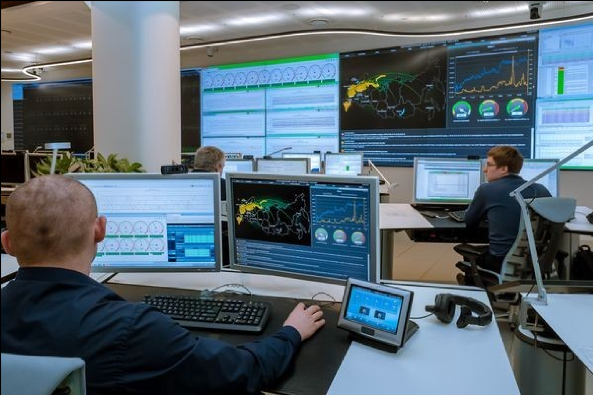
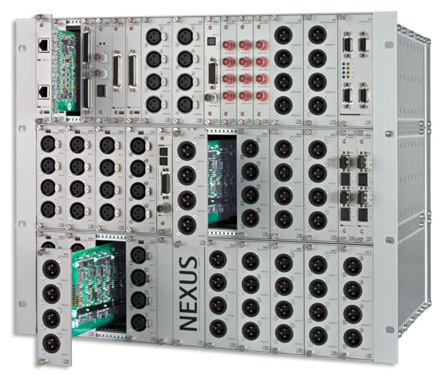
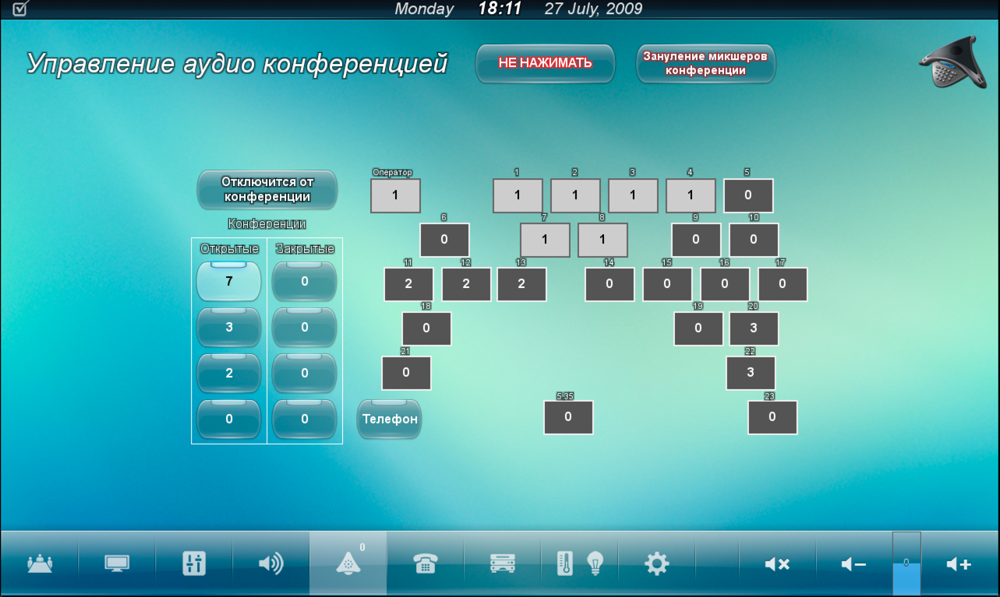
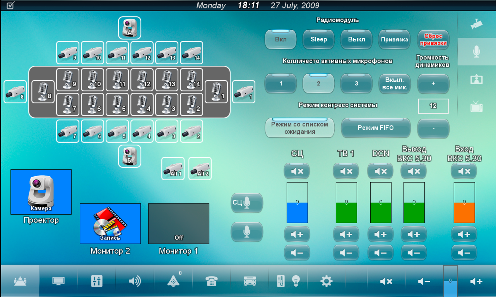

# Amx program example

There is a quite old example (2009-2010) with dirty code but with an interesting audio matrix and <u>very complicated logic</u>.

The project is the Situational Center with two additional conference rooms and a chairperson cabinet. 

There are 23 working spaces with monitors and touch panels which you can see in the picture below.

The most interesting part is the professional audio matrix Stagetec Nexus.

This is a customized optical audio matrix whose individual blocks can be connected together and work as one. 

Inputs, outputs, processor boards - everything is ordered in a certain quantity for a specific project.

<u>The main difficulty of working with this matrix was that back in 2010 there was no normal SDK for it and it was practically impossible to configure the matrix manually.</u>

### The first problem 
Therefore, the entire audio matrix config was assembled directly by the AMX controller.

### The second problem
To make things more complicated I had a unique task for realisation. 

I had to implement an audio communicator with a similar functional like Discord or Slack, where each of the 25 users can connect to a public or private virtual conference room - where all participants will be hearing each other.

Additionally,  each of the participants had the telephone interface and VCS program on PC. When the user was in the virtual conference room he could connect his telephone interface or VCS program to it.

The were two types of users:
1. Regular user 
   - he could use only public virtual conference room
   - could directly call other users
2. Manager user 
   - he could use public and private virtual conference room
   - could directly call other users
   - could create a group of users and add all of them to the virtual conference room

The picture below shows the virtual conference management interface. Here you can see:
- how many people and in which room are they located?
- who is in the same virtual room with the current user
- whether the telephone interface or software video conferencing of the current user is connected to the virtual room

 - You can find the configuration data in <u>"2_3_Audio_Data"</u> file. 
 - And logic in <u>"2_1_Comm_Audio"</u> file. 

### Congress system - Bosch DCN

You may also be interested in a custom module for Bosch DCN. <u>"DCN_Mudule_VAV"</u>

It allows:
- change the operating modes of the congress system - queue, priority, waiting list, replacement
- change the number of active microphones
- turn on, turn off, send wireless microphones to the slip
- rebandage microphones
- monitor the charge of microphone batteries

